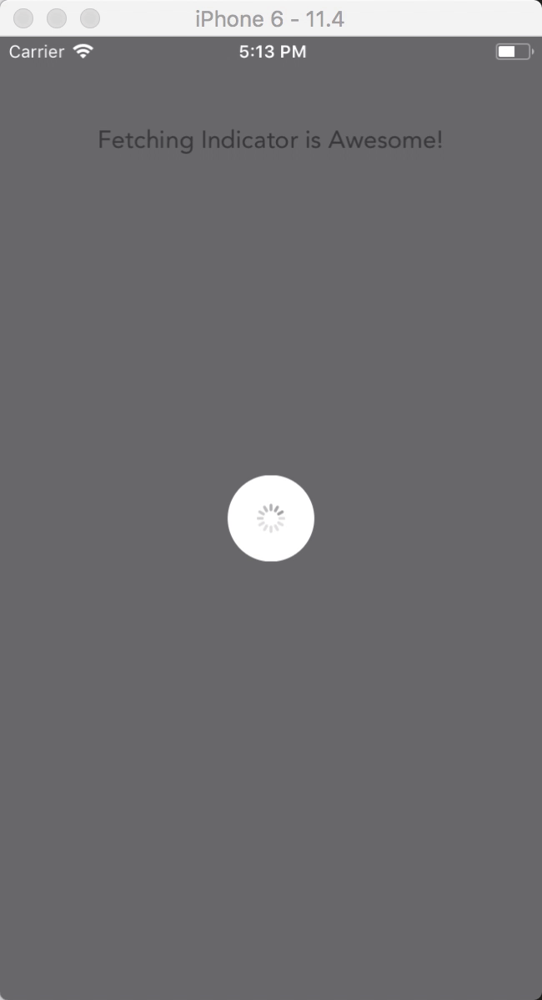

# react-native-fetching-indicator [](https://www.npmjs.com/package/react-native-fetching-indicator) [](http://standardjs.com)
*Fetching indicator component for React Native*

## Installation
```
npm install react-native-fetching-indicator --save
```

## Usage
```jsx
import FetchingIndicator from 'react-native-fetching-indicator'
...
<FetchingIndicator isFetching={this.state.isFetching} />
<FetchingIndicator isFetching={this.props.isFetching} /> // good option if you want to control this component with Redux
<FetchingIndicator isFetching={false} />
<FetchingIndicator isFetching /> // same as <FetchingIndicator isFetching={true} />
...
<FetchingIndicator isFetching message='Loading' color='blue' onBackdropPress={() => { ... }} />
```

PRO TIP 1: Put this component as the last element of a screen  
PRO TIP 2: Put this component as the last element of your higher view hierarchy, control `isFetching` with Redux and use `FetchingIndicator` only once

## Props
| Prop | Type | Default | Note |
|---|---|---|---|
| **`isFetching`** | `boolean` | `false` | Hide or show fetching indicator |
| **`color`** | `color` | `undefined` | `ActivityIndicator` color |
| **`message`** | `string` | `null` | Message to show below `ActivityIndicator` |
| **`messageStyle`** | `style` | `{}` | Message style |
| **`backdropColor`** | `color` | `'rgba(0, 0, 0, 0.50)'` | Backdrop background color |
| **`backdropActiveOpacity`** | `number` | `0.8` | The opacity when backdrop is pressed |
| **`onBackdropPress`** | `function` | `() => null` | Called when backdrop is pressed |

## Demo


## Example
```jsx
import FetchingIndicator from 'react-native-fetching-indicator'

export default class Screen extends Component {
  render () {
    return (
      <View style={styles.mainContainer}>
        <ScrollView style={styles.container}>
          <View style={styles.section} >
            <Image source={Images.logo} />
            <Text style={styles.sectionText}>
              Fetching Indicator is Awesome!
            </Text>
          </View>
        </ScrollView>
        <FetchingIndicator isFetching />
      </View>
    )
  }
}
```
